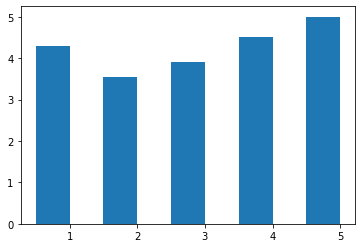
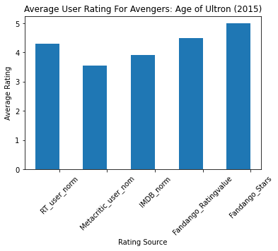
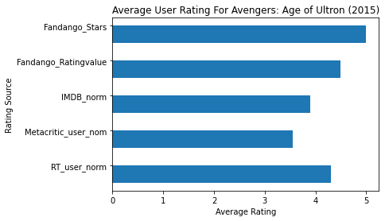
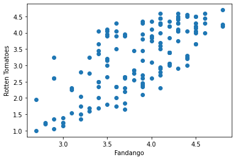

# 绘制条形图
## 例子1.


```python
import pandas as pd
# fandango_scores.csv为电影评分的数据，第一列是电影名称，其余列是评分公司对应的评分
reviews = pd.read_csv('fandango_scores.csv')
cols = ['FILM', 'RT_user_norm', 'Metacritic_user_nom', 'IMDB_norm', 'Fandango_Ratingvalue', 'Fandango_Stars']
norm_reviews = reviews[cols]
print(norm_reviews[:1])
```

                                 FILM  RT_user_norm  Metacritic_user_nom  \
    0  Avengers: Age of Ultron (2015)           4.3                 3.55   
    
       IMDB_norm  Fandango_Ratingvalue  Fandango_Stars  
    0        3.9                   4.5             5.0  
    


```python
import matplotlib.pyplot as plt
from numpy import arange

num_cols = ['RT_user_norm', 'Metacritic_user_nom', 'IMDB_norm', 'Fandango_Ratingvalue', 'Fandango_Stars']

# 取第一行的电影评分数据进行绘制条形图，loc[行索引，列索引]取行列对应的数据
# 柱状图高度，即y轴
bar_heights = norm_reviews.loc[0,num_cols].values
print(bar_heights)
# 柱状图的水平位置，即x轴
bar_positions = arange(5) + 0.75
print(bar_positions)
fig, ax = plt.subplots()
ax.bar(bar_positions, bar_heights, 0.5)
plt.show()
```

    [4.3 3.55 3.9 4.5 5.0]
    [0.75 1.75 2.75 3.75 4.75]
    


    

    


## 例子2.竖状条形图


```python
# 默认x轴是整数值1,2,3,4,...
# 我们可以使用 Axes.set_xticks() 来改变x轴的标签值:

num_cols = ['RT_user_norm', 'Metacritic_user_nom', 'IMDB_norm', 'Fandango_Ratingvalue', 'Fandango_Stars']
bar_heights = norm_reviews.loc[0, num_cols].values
bar_positions = arange(5) + 0.75
tick_positions = range(1,6)
fig, ax = plt.subplots()

ax.bar(bar_positions, bar_heights, 0.5)
ax.set_xticks(tick_positions)
ax.set_xticklabels(num_cols, rotation=45)

ax.set_xlabel('Rating Source')
ax.set_ylabel('Average Rating')
ax.set_title('Average User Rating For Avengers: Age of Ultron (2015)')
plt.show()
```


    

    


## 2.横状条形图


```python
num_cols = ['RT_user_norm', 'Metacritic_user_nom', 'IMDB_norm', 'Fandango_Ratingvalue', 'Fandango_Stars']

bar_widths = norm_reviews.loc[0, num_cols].values
bar_positions = arange(5) + 0.75
tick_positions = range(1,6)
fig, ax = plt.subplots()
ax.barh(bar_positions, bar_widths, 0.5)

ax.set_yticks(tick_positions)
ax.set_yticklabels(num_cols)
ax.set_ylabel('Rating Source')
ax.set_xlabel('Average Rating')
ax.set_title('Average User Rating For Avengers: Age of Ultron (2015)')
plt.show()
```


    

    


# 散点图


```python
#Let's look at a plot that can help us visualize many points.
fig, ax = plt.subplots()
ax.scatter(norm_reviews['Fandango_Ratingvalue'], norm_reviews['RT_user_norm'])
ax.set_xlabel('Fandango')
ax.set_ylabel('Rotten Tomatoes')
plt.show()
```


    

    

