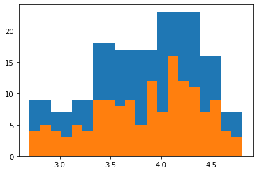
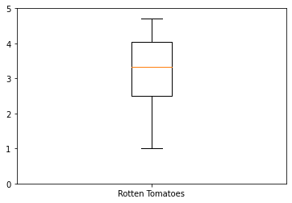
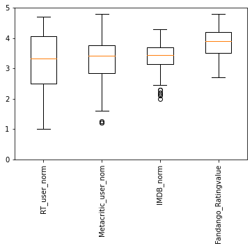

# 绘制直方图（频数图）

## 例子1


```python
import pandas as pd
import matplotlib.pyplot as plt
reviews = pd.read_csv('fandango_scores.csv')
cols = ['FILM', 'RT_user_norm', 'Metacritic_user_nom', 'IMDB_norm', 'Fandango_Ratingvalue']
norm_reviews = reviews[cols]

fig, ax = plt.subplots()
# 频数图，水平方向表示范围，高度表示在某个范围的个数
ax.hist(norm_reviews['Fandango_Ratingvalue'])
# bins=，可以指定多少个箱子，默认是10个
ax.hist(norm_reviews['Fandango_Ratingvalue'],bins=20)
#ax.hist(norm_reviews['Fandango_Ratingvalue'], range=(4, 5),bins=20)
plt.show()
```


    

    


# 绘制箱型图
不太常用，从下到上依次是最小值，1/4分位数,1/2分位数,3/4分位数,最大值
## 例子1


```python
fig, ax = plt.subplots()
ax.boxplot(norm_reviews['RT_user_norm'])
ax.set_xticklabels(['Rotten Tomatoes'])
ax.set_ylim(0, 5)
plt.show()
```


    

    


## 例子2


```python
num_cols = ['RT_user_norm', 'Metacritic_user_nom', 'IMDB_norm', 'Fandango_Ratingvalue']
fig, ax = plt.subplots()
ax.boxplot(norm_reviews[num_cols].values)
ax.set_xticklabels(num_cols, rotation=90)
ax.set_ylim(0,5)
plt.show()
```


    

    

