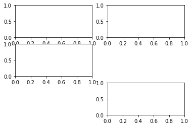
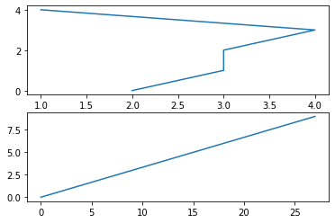
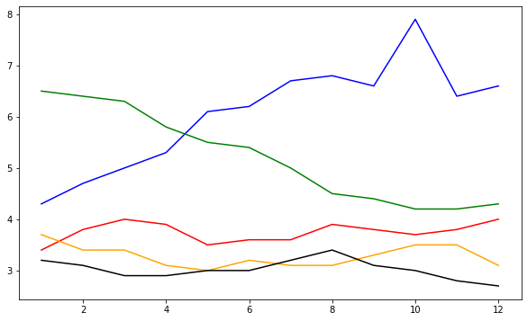
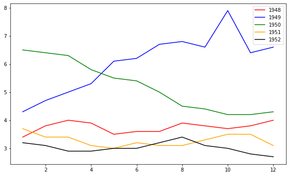

## 绘制子图
### 例子1


```python
#add_subplot(first,second,index) first:第几行,second：第几列，index：第几个图.
import pandas as pd
import matplotlib.pyplot as plt
import matplotlib.pyplot as plt
fig = plt.figure()
ax1 = fig.add_subplot(3,2,1)
ax2 = fig.add_subplot(3,2,2)
ax3 = fig.add_subplot(3,2,3)
ax4 = fig.add_subplot(3,2,6)
plt.show()
```


    

    


###  例子2.例如绘制两个子图


```python
import numpy as np
fig = plt.figure()
#fig = plt.figure(figsize=(3, 3))
ax1 = fig.add_subplot(2,1,1)
ax2 = fig.add_subplot(2,1,2)

ax1.plot(np.random.randint(1,5,5), np.arange(5))
ax2.plot(np.arange(10)*3, np.arange(10))
plt.show()
```


    

    


## 把多条曲线绘制到一个图里
### 例子1.用不同颜色绘制多条曲线


```python
unrate = pd.read_csv('unrate.csv')
unrate['DATE'] = pd.to_datetime(unrate['DATE'])

fig = plt.figure(figsize=(10,6))
unrate['MONTH'] = unrate['DATE'].dt.month
unrate['MONTH'] = unrate['DATE'].dt.month
colors = ['red', 'blue', 'green', 'orange', 'black']  #颜色
for i in range(5):
    start_index = i*12
    end_index = (i+1)*12
    subset = unrate[start_index:end_index]
    plt.plot(subset['MONTH'], subset['VALUE'], c=colors[i])
    
plt.show()
```


    

    


### 例子2.把标签显示出来


```python
fig = plt.figure(figsize=(10,6))
colors = ['red', 'blue', 'green', 'orange', 'black']
for i in range(5):
    start_index = i*12
    end_index = (i+1)*12
    subset = unrate[start_index:end_index]
    label = str(1948 + i)
    plt.plot(subset['MONTH'], subset['VALUE'], c=colors[i], label=label)
plt.legend(loc='best')
# plt.legend(loc='upper left')
#print help(plt.legend)
plt.show()
```


    

    

