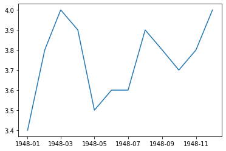
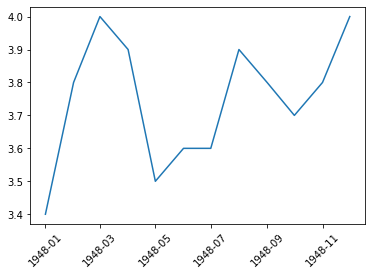
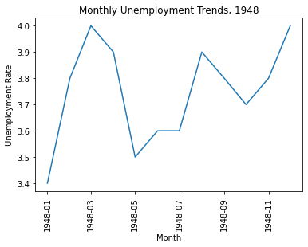

# Python数据可视化
# 使用matplotlib绘制最简单的趋势图


```python
import pandas as pd
unrate = pd.read_csv('unrate.csv')  # 使用pandas读取数据
unrate['DATE'] = pd.to_datetime(unrate['DATE'])
print(unrate.head(12)) # 查看前12条数据
```

             DATE  VALUE
    0  1948-01-01    3.4
    1  1948-02-01    3.8
    2  1948-03-01    4.0
    3  1948-04-01    3.9
    4  1948-05-01    3.5
    5  1948-06-01    3.6
    6  1948-07-01    3.6
    7  1948-08-01    3.9
    8  1948-09-01    3.8
    9  1948-10-01    3.7
    10 1948-11-01    3.8
    11 1948-12-01    4.0
    


```python
import matplotlib.pyplot as plt
#%matplotlib inline
#Using the different pyplot functions, we can create, customize, and display a plot. For example, we can use 2 functions to :
first_twelve = unrate[0:12]
plt.plot(first_twelve['DATE'], first_twelve['VALUE'])
plt.show()
```


    

    


```python
# 我们可以设置x轴的标签旋转
plt.plot(first_twelve['DATE'], first_twelve['VALUE'])
plt.xticks(rotation=45)
#print help(plt.xticks)
plt.show()
```


    

    


```python
#xlabel(): 给x轴标签命名
#ylabel(): 给y轴标签命名
#title(): 绘图标题

plt.plot(first_twelve['DATE'], first_twelve['VALUE'])
plt.xticks(rotation=90)
plt.xlabel('Month')
plt.ylabel('Unemployment Rate')
plt.title('Monthly Unemployment Trends, 1948')
plt.show()
```


    

    

